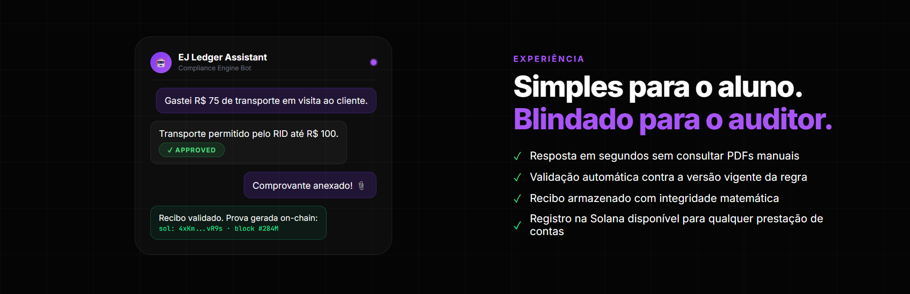
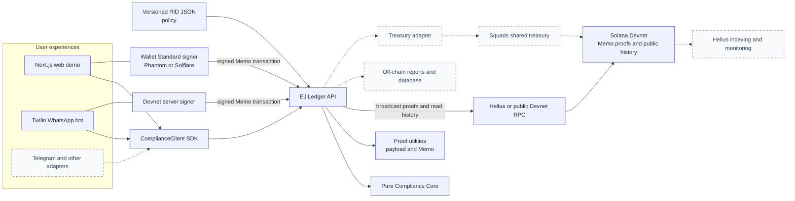

# EJ Ledger

*Turn internal expense policies into clear, verifiable decisions.*

[](https://www.typescriptlang.org/)
[](https://nextjs.org/)
[](https://solana.com/developers)
[](https://hono.dev/)
[](https://www.twilio.com/docs/whatsapp/sandbox)
[](https://vitest.dev/)

<p align="center">
  
</p>

EJ Ledger turns a structured RID policy into deterministic expense decisions and privacy-preserving Solana devnet proofs for Junior Enterprises.

## Architecture

> A versioned RID policy powers the Compliance Core; the API and SDK deliver its decisions to web and WhatsApp, while Solana is the verifiable proof layer that anchors approved expense records to the EJ Ledger ecosystem.



**Legend:** solid nodes and arrows are built in the MVP. Dashed nodes and arrows are the next evolution of the platform.

The Compliance Core is pure business logic. It does not import HTTP, Solana, Helius, wallets, filesystem APIs, UI code, WhatsApp, or Telegram.

The Solana boundary uses current Solana defaults: the browser demo discovers Phantom and Solflare through Wallet Standard-compatible connectors, while the API broadcasts signed base64 wire transactions through `@solana/kit` RPC.

## What EJ Ledger does

Junior Enterprise members should not need to interpret a PDF policy or wait for a manual answer before knowing whether an expense follows the RID. EJ Ledger makes those rules executable, gives every interface the same deterministic decision, and creates a verifiable proof when an approved expense is recorded.

## How it works

1. **Policy:** an EJ structures and versions its RID rules as policy JSON.
2. **Decision:** the web demo or WhatsApp bot sends an expense through the SDK; the API asks the Compliance Core whether it is approved, blocked, or needs approval.
3. **Proof:** for an approved test request, the system creates a Solana Memo proof containing hashes and decision metadata, never the raw receipt, purpose, or conversation.
4. **History:** configured organization members can view the public proof metadata and hashes; private evidence stays off-chain.

## Built now and next

| Built in the MVP | Next evolution |
| --- | --- |
| Versioned RID policies, pure Compliance Core, API, TypeScript SDK, web demo, Phantom/Solflare signing, WhatsApp Sandbox, Solana devnet Memo proofs, and shared proof history. | Telegram and other adapters, Helius indexing and monitoring, persistent off-chain reports, real authorization, and Squads shared-treasury execution. |

Helius is optional current RPC infrastructure for broadcasting proofs and reading history; advanced indexing and monitoring are planned improvements. Squads is not implemented in this MVP: it will control shared treasury execution after the Compliance Core has made a policy decision.

## Repository map

| Area | Responsibility |
| --- | --- |
| `packages/core` | Pure RID policy decisions; no HTTP, UI, wallet, or Solana dependency. |
| `packages/sdk` | Typed client used by every frontend or bot. |
| `packages/proof` | Deterministic hashes, Memo payloads, and signer interfaces. |
| `apps/api` | HTTP boundary, policy loading, proof intents, transaction broadcast, and proof history. |
| `apps/demo` | Next.js demo with Wallet Standard-compatible Phantom and Solflare connections. |
| `apps/whatsapp` | Twilio Sandbox adapter that translates Portuguese conversation into SDK calls. |

## Setup

```bash
npm install
npm run test
npm run typecheck
npm run build
```

Optional environment:

```bash
cp .env.example .env.local
```

Then edit values if needed:

```bash
HELIUS_RPC_URL=https://devnet.helius-rpc.com/?api-key=YOUR_KEY
NEXT_PUBLIC_API_URL=http://localhost:8787
NEXT_PUBLIC_SOLANA_RPC_URL=https://api.devnet.solana.com
NEXT_PUBLIC_SOLANA_WS_URL=wss://api.devnet.solana.com
```

If `HELIUS_RPC_URL` is not set, the API falls back to public Solana devnet RPC.

## Run Locally

Start the API:

```bash
npm run dev:api
```

Start the demo:

```bash
npm run dev:demo
```

Open:

```text
http://localhost:3000
```

Install Phantom or Solflare, switch to devnet, and fund the wallet with devnet SOL before creating proof.

Recommended final gates:

```bash
npm run test
npm run typecheck
npm run build
```

Run `typecheck` and `build` sequentially. Next.js generates route types under `.next`, so running both at the same time can race on generated files.

## API Examples

Approved:

```bash
curl -s http://localhost:8787/v1/expenses/check \
  -H 'content-type: application/json' \
  -d '{"organizationId":"ej-demo","memberId":"member-001","amount":80,"currency":"BRL","category":"transportation","purpose":"Client meeting"}'
```

Needs approval:

```bash
curl -s http://localhost:8787/v1/expenses/check \
  -H 'content-type: application/json' \
  -d '{"organizationId":"ej-demo","memberId":"member-001","amount":120,"currency":"BRL","category":"transportation","purpose":"Client meeting"}'
```

Blocked:

```bash
curl -s http://localhost:8787/v1/expenses/check \
  -H 'content-type: application/json' \
  -d '{"organizationId":"ej-demo","memberId":"member-001","amount":50,"currency":"BRL","category":"entertainment","purpose":"Team event"}'
```

Proof intent:

```bash
curl -s http://localhost:8787/v1/proofs/intent \
  -H 'content-type: application/json' \
  -d '{"organizationId":"ej-demo","memberId":"member-001","amount":80,"currency":"BRL","category":"transportation","purpose":"Client meeting"}'
```

## Manual Wallet Smoke Test

1. Start the API and demo.
2. Open `http://localhost:3000`.
3. Connect Phantom or Solflare on devnet.
4. Click the approved scenario.
5. Check the expense.
6. Create proof.
7. Review the displayed transaction summary, then approve the simulated Memo transaction in your wallet.
8. Open the returned Solana Explorer devnet link.

## Shared Organization Proof History

The demo can list public EJ Ledger proof metadata directly from Solana devnet. Configure the wallets allowed to view the shared organization history in `policies/demo-members.json`:

```json
{
  "organizationId": "ej-demo",
  "members": [
    {
      "memberId": "member-001",
      "displayName": "Demo member",
      "walletAddress": "YOUR_PUBLIC_WALLET_ADDRESS"
    }
  ]
}
```

Restart the API after editing the roster. Connect a configured wallet in the demo to view every configured member's successful `EJ_COMPLIANCE:v1` Memo proof, including signer, decision, policy version, time, hashes, confirmation state, and Explorer link.

This is a no-database hackathon feature. The roster creates the off-chain association between a wallet and the EJ; it is not authentication. Amounts, categories, purposes, receipts, and other private expense details cannot be recovered from Solana because the Memo stores hashes only.

## Privacy

Never put sensitive operational data directly on-chain. The proof memo contains hashes and decision metadata only. Do not include names, phone numbers, receipt contents, full RID documents, raw WhatsApp/Telegram messages, or detailed expense purpose text in the memo.

## WhatsApp Sandbox Bot

The WhatsApp adapter is a devnet-only Twilio Sandbox MVP. It translates Portuguese messages into SDK calls; it contains no compliance rules.

### 1. Create the local configuration

Never copy secrets into Git, screenshots, chat, or a personal wallet. The local file is ignored by Git:

```bash
cp apps/whatsapp/.env.example apps/whatsapp/.env.local
```

Fill `apps/whatsapp/.env.local` with the following values:

| Variable | Value and where to get it |
| --- | --- |
| `PORT` | Keep `8788` unless that port is already in use. |
| `PUBLIC_WEBHOOK_URL` | The exact public HTTPS callback URL, including `/webhooks/twilio/whatsapp`. See the tunnel step below. |
| `TWILIO_ACCOUNT_SID` | **Account SID** from the Twilio Console Account Dashboard. |
| `TWILIO_AUTH_TOKEN` | **Auth Token** from the Twilio Console Account Dashboard. Treat it as a secret. |
| `TWILIO_ALLOWED_FROM` | Your test WhatsApp number in E.164 form, for example `whatsapp:+5511999999999`. This is the only sender the bot accepts. |
| `OPENAI_API_KEY` | An API key created in the [OpenAI API platform](https://platform.openai.com/api-keys), not a ChatGPT password. |
| `OPENAI_MODEL` | Keep `gpt-4o-mini` for the MVP unless your API project uses another supported model. |
| `EJ_LEDGER_API_BASE_URL` | Keep `http://localhost:8787` when API and bot run on this machine. |
| `SOLANA_RPC_URL` | A Solana devnet RPC URL. Use your Helius devnet URL if available, otherwise `https://api.devnet.solana.com`. |
| `WHATSAPP_ORGANIZATION_ID` / `WHATSAPP_MEMBER_ID` | Keep `ej-demo` / `member-001` for this MVP. |
| `WHATSAPP_VIEWER_WALLET` | A public wallet address already configured for `ej-demo` in `policies/demo-members.json`; it authorizes the demo history lookup. |
| `EJ_LEDGER_DEVNET_SIGNER_SECRET_KEY` | JSON byte array for a new, dedicated bot keypair. Never use, export, or paste a Phantom/Solflare seed phrase here. |

### 2. Create and fund the dedicated bot signer

Generate a disposable devnet key locally. The command hides the recovery phrase; do not share the generated JSON file or its contents.

```bash
NO_DNA=1 solana-keygen new --silent --no-bip39-passphrase --outfile /tmp/ej-ledger-whatsapp-devnet-keypair.json
NO_DNA=1 solana-keygen pubkey /tmp/ej-ledger-whatsapp-devnet-keypair.json
```

Copy the complete JSON byte array from the temporary file into `EJ_LEDGER_DEVNET_SIGNER_SECRET_KEY` without quotes. Copy only the printed public address into `policies/demo-members.json` with a label such as `WhatsApp bot`, then restart the API. Fund that public address with valueless devnet SOL, for example:

```bash
NO_DNA=1 solana airdrop 1 YOUR_BOT_PUBLIC_ADDRESS --url devnet
```

After the key is copied to `.env.local`, remove the temporary file:

```bash
rm -f /tmp/ej-ledger-whatsapp-devnet-keypair.json
```

The bot signer pays only the devnet transaction fee. It is not the student's personal-wallet signature.

### 3. Configure Twilio Legacy WhatsApp Sandbox

Use the **Legacy Console WhatsApp Sandbox**. The newer Twilio **Try out WhatsApp** trial flow does not support direct TwiML replies, while this MVP replies to an incoming webhook with TwiML.

1. Open [Twilio WhatsApp Sandbox](https://www.twilio.com/console/sms/whatsapp/sandbox) and activate it.
2. In WhatsApp, send the displayed `join <sandbox-code>` message to the displayed Sandbox number. This number can differ from the newer Trial number.
3. Open **Sandbox settings** and set **When a message comes in** to the exact value of `PUBLIC_WEBHOOK_URL` using `POST`.
4. Do not use the business-initiated template screen for this flow. A student message opens the conversation window needed for the bot's free-form reply.

### 4. Expose the local webhook

The Sandbox needs a public HTTPS URL. With Cloudflare Quick Tunnel, keep this terminal open for the whole manual test:

```bash
cloudflared tunnel --url http://localhost:8788
```

Copy the generated `https://...trycloudflare.com` URL into `PUBLIC_WEBHOOK_URL` as:

```text
https://your-tunnel.trycloudflare.com/webhooks/twilio/whatsapp
```

### 5. Start and manually test

Start the API, the WhatsApp adapter, and the tunnel in separate terminals:

```bash
npm run dev:api
npm run dev:whatsapp
cloudflared tunnel --url http://localhost:8788
```

From the WhatsApp number configured in `TWILIO_ALLOWED_FROM`, send:

```text
Gastei R$70 de transporte para falar com cliente
```

Expected flow:

1. The bot repeats the parsed amount, category, and purpose. Reply `CONFIRMAR`, `CORRIGIR`, or `CANCELAR`.
2. For an approved expense, it asks for a PDF, JPEG, or PNG receipt up to 5 MB.
3. Attaching the receipt explicitly confirms the devnet test. The bot hashes and immediately discards the file, simulates/signs/submits one Memo proof, then returns a Solana Explorer link. No SOL is transferred.
4. Send `HISTÓRICO` to receive the ten newest public proofs, including the public hashes and Explorer links.

The receipt hash is committed in an `EJ_COMPLIANCE:v2` Memo. Receipts, phone numbers, conversation text, amount, category, and purpose are never sent on-chain. The no-database history can only show public chain metadata and hashes; it cannot recover private off-chain records.

## Demo Pitch

Every EJ has a RID, but members still ask finance whether an expense is allowed. EJ Ledger turns the RID into executable infrastructure: an API and SDK that return a deterministic compliance decision. The demo then signs a Solana devnet memo with Phantom or Solflare to prove that the decision existed under a specific policy version. Future adapters can connect the same Core to WhatsApp, Telegram, or Squads without changing compliance logic.
